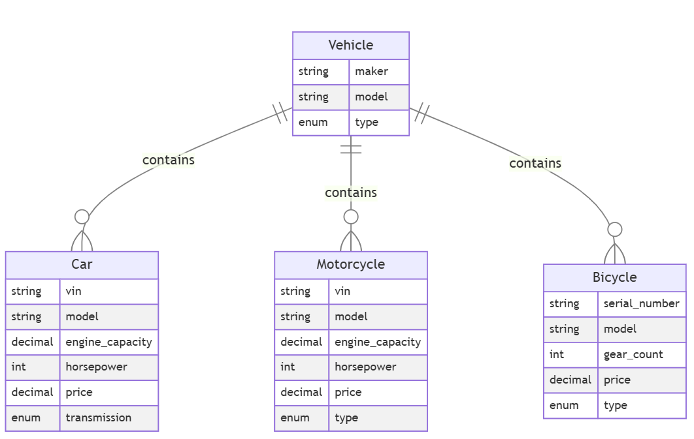
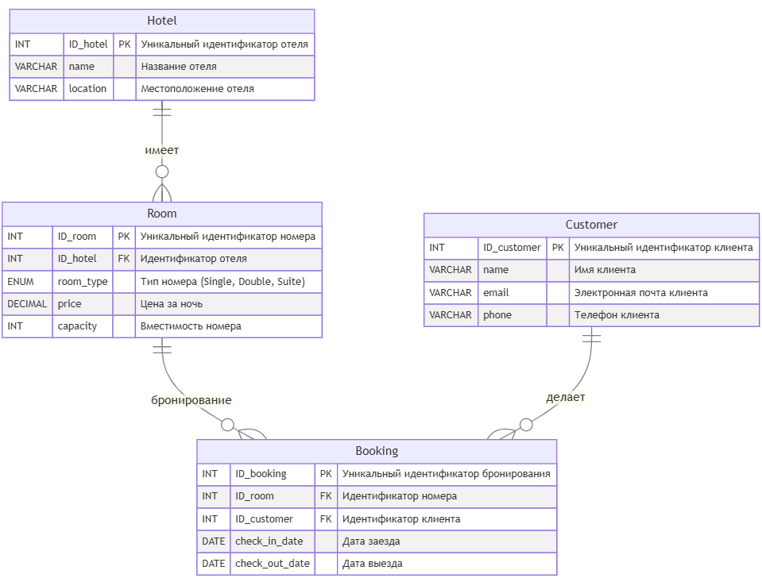

# Итоговый проект по дисциплине «База данных»

В данном репозитории представлены скрипты для работы с четырьмя базами данных. Проект реализован с использованием СУБД MySQL.
Каждая база данных размещена в отдельной директории и включает:
- Скрипты создания структуры таблиц
- Скрипты заполнения тестовыми данными
- Примеры SQL-запросов

## Как запустить скрипты

Существует два способа запуска скриптов для инициализации структуры баз данных, их заполнения и выполнения запросов.

### Требования
Перед запуском убедитесь, что:
- установлена СУБД MySQL
- доступен пользователь root и установлен пароль (только для способа 1)

### Способ 1: Использование стартовых скриптов

В корне проекта находятся готовые скрипты, которые автоматизируют процесс выполнения SQL-файлов. Выберите скрипт в зависимости от вашей операционной системы.

**Для Windows:**
Запустите файл `run.bat` (через командную строку или просто двойным кликом в проводнике).

**Для macOS и Linux:**
Откройте терминал, перейдите в директорию проекта и запустите bash-скрипт:
```sh
sh run.sh
```
Или сделайте файл исполняемым и запустите его напрямую:
```sh
chmod +x run.sh
./run.sh
```

### Способ 2: Ручной запуск

Скрипты для каждой базы данных можно запустить вручную. Для этого необходимо зайти в папку соответствующей базы данных (например, `db_1_transport`) и последовательно выполнить код из файлов в вашем SQL-клиенте (MySQL Workbench, DBeaver и т.д.) в следующем порядке:

1. **`schema.sql`** — создание необходимой структуры БД.
2. **`data.sql`** — заполнение таблиц тестовыми записями.
3. **`queries.sql`** — выполнение запросов, реализующих решение поставленных задач.

## Описание баз данных и запросов

### 1. Транспортные средства (db_1_transport)

База данных хранит информацию об ассортименте транспортных средств.



**Задача 1:** Выборка мощных спортбайков (более 150 л.с.), стоимость которых не превышает $20,000.

Особенности решения:
* Используется объединение таблиц `JOIN` для получения данных о моделях и их характеристиках
* Применяется фильтрация по нескольким условиям (мощность, цена, тип) с помощью `WHERE`

**Задача 2:** Анализ моделей всех типов ТС по заданным критериям.

Особенности решения:
* Применяется `JOIN` для получения данных из связанных таблиц
* Для каждого типа ТС задаются собственные условия фильтрации (мощность, объем двигателя, цена, количество передач) через `WHERE`
* Используется объединение результатов нескольких запросов с помощью `UNION ALL` для работы с разными типами ТС

### 2. Автомобильные гонки (db_2_racing)

База данных для учета соревнований и гоночной статистики.


**Задача 1:** Определение лидеров внутри каждого из классов по лучшей (минимальной) средней позиции в гонках.

Особенности решения:
* Используется CTE для поэтапного построения запроса
* Применяется агрегация `AVG`, `COUNT` для расчёта средней позиции и количества гонок
* Выполняется группировка GROUP BY по болиду и его классу
* Определяются лучшие результаты в каждом классе с помощью вычисления минимального среднего значения
* Используется `JOIN` для сопоставления общей статистики с лучшими показателями по классам

**Задача 2:** Поиск абсолютного чемпиона среди всех автомобилей.

Особенности решения:
* Используется объединение таблиц `JOIN` для получения данных об автомобилях, их результатах и классах
* Применяется агрегация данных `AVG`, `COUNT` для расчёта среднего места и количества гонок
* Используется группировка `GROUP BY` по модели автомобиля

**Задача 3:** Определение лучших классов по среднему показателю и вывод информации об автомобилях из этих классов.

Особенности решения:
* Используется несколько CTE для поэтапной обработки данных
* Выполняется агрегирование для расчёта среднего положения по классам
* Определяется лучший класс на основе минимального среднего значения (`MIN`)
* Применяется фильтрация для отбора только лучших классов
* Используются `JOIN` для объединения данных об автомобилях, результатах гонок и классах
* Дополнительно рассчитывается общее количество гонок для каждого класса (`COUNT`)

**Задача 4:** Выборка автомобилей, превзошедших средний результат своего класса.

Особенности решения:
* Используется несколько CTE для поэтапного расчёта агрегированных данных
* В первом подзапросе рассчитываются средние позиции и количество гонок для каждого автомобиля (`AVG`, `COUNT`, `GROUP BY`)
* Во втором подзапросе вычисляется средний результат по каждому классу с дополнительной фильтрацией классов (`HAVING`)
* Применяется `JOIN` для сравнения показателей автомобилей со средними значениями их класса
* Отбираются только те автомобили, чьи результаты лучше среднего по классу

**Задача 5:** Анализ машин чья средняя позиция хуже третьей, с подсчетом количества низких результатов в рамках их классов.

Особенности решения:
* Используется несколько CTE для поэтапной обработки данных
* Первая выборка рассчитывает среднюю позицию и количество гонок для каждой машины (`AVG`, `COUNT`, `GROUP BY`)
* Вторая выборка агрегирует данные на уровне классов, включая подсчет количества машин с низкими результатами
* Применяется объединение для связывания статистики машин, классов и дополнительной информации
* Используется фильтрация по средней позиции `WHERE` для отбора машин с результатом хуже третьего места

### 3. Бронирование отелей (db_3_booking)

Модель системы для бронирования гостиниц.



**Задача 1:** Поиск лояльных клиентов, совершивших больше двух бронирований в разных отелях. 

Особенности решения:
* Используется объединение таблиц `JOIN` для получения полной информации о клиентах, бронированиях, комнатах и отелях
* Применяется группировка данных `GROUP BY` для подсчета количества бронирований и усреднения длительности пребывания
* Используется фильтрация агрегированных данных через `HAVING` для выявления клиентов с более чем двумя бронированиями в разных отелях
* Для каждого клиента вычисляются дополнительные показатели: список посещенных отелей `GROUP_CONCAT` и среднее количество дней пребывания `AVG(DATEDIFF)`

**Задача 2:** Анализ активных клиентов, чьи суммарные траты на аренду номеров за все время превысили 500 долларов.

Особенности решения:
* Используется несколько CTE для поэтапной обработки данных
* В первом CTE выбираются клиенты с более чем 2 бронированиями в разных отелях
* Во втором CTE ыбираются клиенты, потратившие более $500 на аренду
* Объединение результатов двух временных таблиц с помощью `JOIN` позволяет найти клиентов, удовлетворяющих обоим условиям
* Применяется агрегация `SUM`, `COUNT` для подсчета общих расходов, количества бронирований и уникальных отелей

**Задача 3:** Сегментация клиентов по предпочитаемым отелей (Дешевый/Средний/Дорогой)

Особенности решения:
* Используется несколько CTE для поэтапной обработки данных:
    * категоризация отелей
    * связывание клиентов с посещёнными отелями
    * определение предпочтений каждого клиента
* Используется агрегация данных для классификации отелей по средней цене
* Применяется условная логика `CASE` для назначения категорий отелей (Дешевый, Средний, Дорогой)
* Для каждого клиента определяется предпочтительный тип отеля на основе посещений
* Результаты упорядочиваются по приоритету категорий отелей `ORDER BY CASE`

### 4. Организационная структура (db_4_organization_structure)

База данных, описывающая устройство компании.


**Задача 1:** Построение иерархического дерева подчинённых Ивана Иванова.

Особенности решения:
* Используется рекурсивное обобщённое табличное выражение `WITH RECURSIVE` для построения иерархии сотрудников
* Применяется `JOIN` для последовательного получения всех уровней подчинённости
* Используются `LEFT JOIN` для добавления информации о департаментах, ролях, проектах и задачах
* Реализована агрегация данных с помощью `GROUP_CONCAT` для объединения списка проектов и задач

**Задача 2:** Построение дерева сотрудников со статистикой задач и прямых подчинённых.

Особенности решения:
* Используется рекурсивное выражение `WITH RECURSIVE` для построения иерархии сотрудников
* Применяется `JOIN` для получения данных о подразделениях, ролях, проектах и задачах
* Реализован подсчёт количества задач с помощью агрегатных функций `COUNT`
* Вычисляется количество прямых подчинённых через отдельный подзапрос с группировкой
* Используется агрегация строк `GROUP_CONCAT` для объединения списка проектов и задач
* Применяется обработка NULL-значений `COALESCE`, `NULLIF` для корректного отображения данных


**Задача 3:** Поиск и анализ структуры менеджмента организации. Расчет количества вложенных подчинённых для каждого сотрудника с должностью Менеджер.

Особенности решения:
* Используется рекурсивное выражение `WITH RECURSIVE` для построения полной иерархии сотрудников начиная с менеджеров
* Реализовано отслеживание корневого менеджера RootManagerID для корректного подсчёта всех вложенных подчинённых
* Применяется фильтрация по менеджерам с помощью `JOIN` и `WHERE`
* Вычисляется общее количество подчинённых (включая вложенные уровни) через агрегатную функцию `COUNT`
* Используется группировка `GROUP BY` для расчёта статистики по каждому менеджеру
* Применяется агрегация строк `GROUP_CONCAT` для объединения списка проектов и задач
* Добавлена фильтрация менеджеров, имеющих хотя бы одного подчинённого